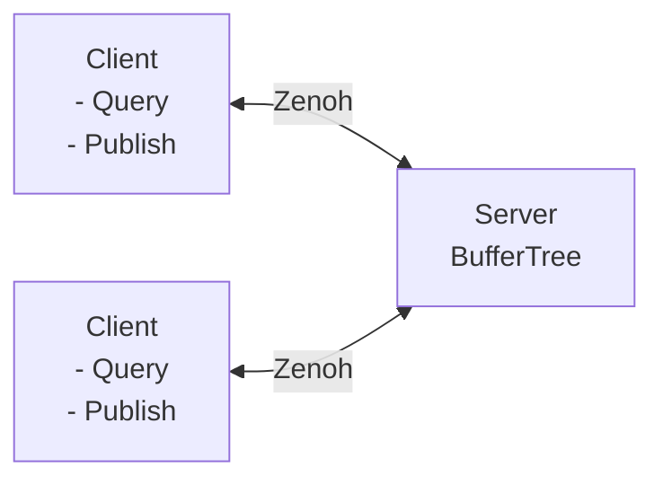
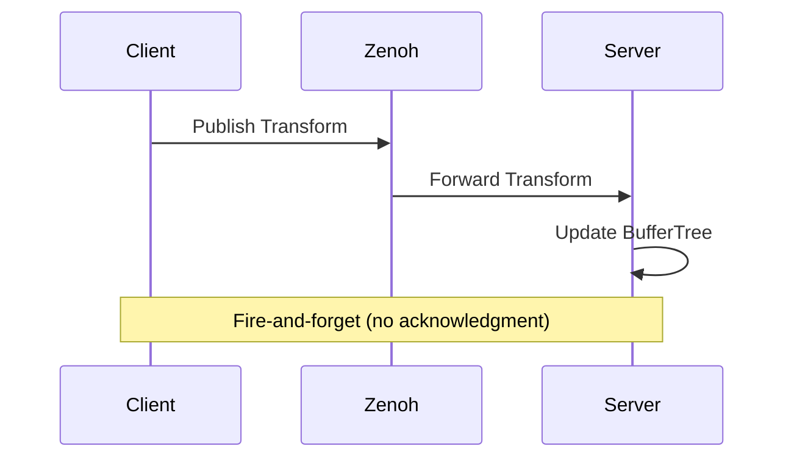
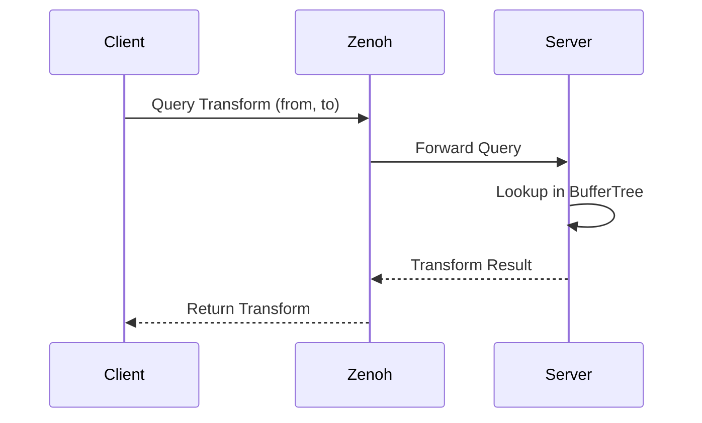

# Schiebung Comms

Client-Server communication for Schiebung transforms using Zenoh and capn'proto. Currently no Python bindings are provided; however, it is possible to connect against the server with any zenoh client. If we see the need for users to run the server in a python environment, we can create the bindings.

## Overview

The comms package provides a client-server architecture for sharing transform data between processes. It uses [Zenoh](https://zenoh.io/) for low-latency inter-process communication.
We use a simple capn'proto schema to serialize the data (currently none of the fancy cap'n proto RPC Features are used).

## Architecture



### Transform Update Flow



### Transform Request Flow



## Usage

### Client Example

```rust
use comms::TransformClient;

#[tokio::main]
async fn main() {
    let client = TransformClient::new().await.unwrap();

    // Publish a transform
    client.publish_transform("base", "sensor", transform).await;

    // Query a transform
    let result = client.request_transform("base", "sensor").await;
}
```
