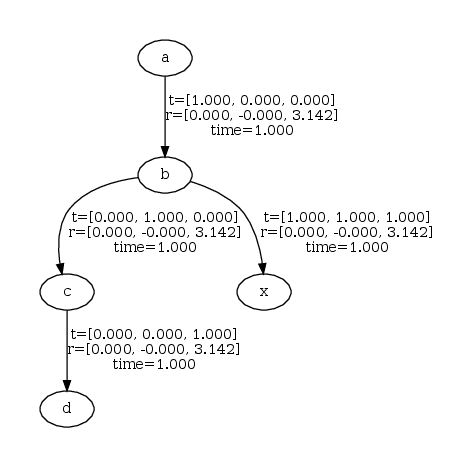

### Client-Server

Here the server runs as a standalone process. Clients can connect to the server and request and send transforms.

```bash
cargo run --bin schiebung-server
```

Now the server is running we need to provide transforms, this can be done manually with a client:

Update the server with a new static transform:

```bash
cargo run --bin schiebung-client update --from a --to b --tx 1 --ty 0 --tz 0 --qx 0 --qy 0 --qz 0 --qw 1
cargo run --bin schiebung-client update --from b --to c --tx 0 --ty 1 --tz 0 --qx 0 --qy 0 --qz 0 --qw 1
cargo run --bin schiebung-client update --from c --to d --tx 0 --ty 0 --tz 1 --qx 0 --qy 0 --qz 0 --qw 1
cargo run --bin schiebung-client update --from b --to x --tx 1 --ty 1 --tz 1 --qx 0 --qy 0 --qz 0 --qw 1
```

Request a transform from the server:

```bash
cargo run --bin schiebung-client request --from a --to d
Transform:
a -> d:
stamp: 0,
translation: 1.000, -1.000, 1.000,
rotation (xyzw): 0.000, 0.000, -1.000, -0.000,
rotation (rpy): -0.000, -0.000, 3.142
```

Visualize the transforms:

The default save path is your home directory and may be changed within the server config.

```bash
cargo run --bin schiebung-client visualize
```

